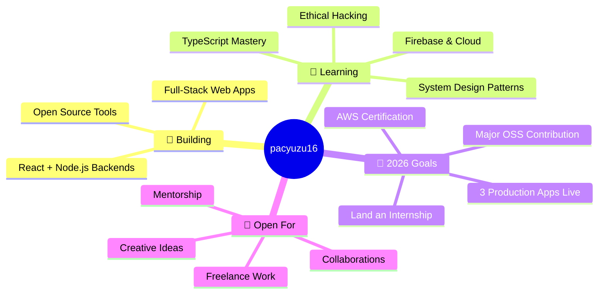

<!-- ╔══════════════════════════════════════════════════════════╗ -->
<!--              ULTRA ANIMATED HEADER — capsule-render           -->
<!-- ╚══════════════════════════════════════════════════════════╝ -->


<!-- ╔══════════════════════════════════════════════════════════╗ -->
<!--                  TYPING ANIMATION                             -->
<!-- ╚══════════════════════════════════════════════════════════╝ -->

<h1 align="center">
  
</h1>

<!-- SOCIAL PROOF ROW -->
<p align="center">
  <a href="https://github.com/pacyuzu16?tab=followers">
    
  </a>
  &nbsp;&nbsp;
  
  &nbsp;&nbsp;
  
</p>

<br/>

<!-- STATUS BADGES -->
<p align="center">
  
  
  
  
</p>

<br/>

---

<!-- ╔══════════════════════════════════════════════════════════╗ -->
<!--                     ABOUT ME                                  -->
<!-- ╚══════════════════════════════════════════════════════════╝ -->

## 🧑🏾‍💻 About Me

<table width="100%">
<tr>
<td valign="top" width="50%">

```yaml
┌─────────────────────────────────────┐
│  $ whoami                           │
├─────────────────────────────────────┤
│  name     :  Cyuzuzo Pacifique      │
│  alias    :  pacyuzu16              │
│  location :  Kigali, Rwanda 🇷🇼     │
│  edu      :  BSc Comp Eng @ UR      │
│  stack    :  React • Node • Fire    │
│  learning :  System Design • Cloud  │
│  contact  :  wa.me/250789171532     │
│  portfolio:  pacyuzu16.vercel.com   │
└─────────────────────────────────────┘
```

</td>
<td valign="top" width="50%">

```bash
  💻 Currently Building
  ├── Full-stack web applications
  ├── React + Node.js backends
  └── Open source projects

  🌱 Currently Learning
  ├── Firebase & Cloud Architecture
  ├── TypeScript • System Design
  └── Ethical Hacking Concepts 🔐

  ⚡ Fun Fact
  └── 3hrs debugging = 1 semicolon 😅
```

</td>
</tr>
</table>

---

<!-- ╔══════════════════════════════════════════════════════════╗ -->
<!--                  WHAT I'M EXPLORING                           -->
<!-- ╚══════════════════════════════════════════════════════════╝ -->

## 🗺️ What I'm Exploring



---

<!-- ╔══════════════════════════════════════════════════════════╗ -->
<!--                    TROPHY CASE                                -->
<!-- ╚══════════════════════════════════════════════════════════╝ -->

## 🏆 GitHub Trophies

<p align="center">
  
</p>

---

<!-- ╔══════════════════════════════════════════════════════════╗ -->
<!--                     TECH ARSENAL                              -->
<!-- ╚══════════════════════════════════════════════════════════╝ -->

## ⚡ Tech Arsenal

<div align="center">

### 🖥️ Languages

<a href="https://skillicons.dev">
  
</a>

<br/><br/>

### 🧰 Frameworks & Libraries

<a href="https://skillicons.dev">
  
</a>

<br/><br/>

### 🗄️ Databases

<a href="https://skillicons.dev">
  
</a>

<br/><br/>

### ☁️ Cloud & DevOps

<a href="https://skillicons.dev">
  
</a>

<br/><br/>

### 🛠️ Tools & Platforms

<a href="https://skillicons.dev">
  
</a>

</div>

---

<!-- ╔══════════════════════════════════════════════════════════╗ -->
<!--                    GITHUB STATS                               -->
<!-- ╚══════════════════════════════════════════════════════════╝ -->

## ⚡ GitHub Stats

<div align="center">
  
  
</div>

<div align="center" style="margin-top:1em">
  
</div>

---

<!-- ╔══════════════════════════════════════════════════════════╗ -->
<!--                  PROFILE ANALYTICS                            -->
<!-- ╚══════════════════════════════════════════════════════════╝ -->

## 📊 Profile Analytics

<p align="center">
  
</p>
<p align="center">
  
  
  
  
</p>

---

<!-- ╔══════════════════════════════════════════════════════════╗ -->
<!--                  FEATURED PROJECTS                            -->
<!-- ╚══════════════════════════════════════════════════════════╝ -->

## 🚀 Featured Projects

<div align="center">


  <a href="https://github.com/pacyuzu16/Rocket-game">
    
  </a>
  <a href="https://github.com/pacyuzu16/StudentApp">
    
  </a>


<a href="https://github.com/pacyuzu16?tab=repositories">
  
</a>

</div>

---

<!-- ╔══════════════════════════════════════════════════════════╗ -->
<!--                 2025 LEARNING ROADMAP                         -->
<!-- ╚══════════════════════════════════════════════════════════╝ -->

## 🎯 2025 Learning Roadmap

<table>
<tr>
<td valign="top" width="33%">

**🖼️ Frontend & Mobile**

- ✅ React Fundamentals
- ✅ Next.js Basics
- ✅ Tailwind CSS
- ⏳ React Native / Expo
- ⏳ Advanced TypeScript
- 🎯 PWA Development

</td>
<td valign="top" width="33%">

**☁️ Backend & Cloud**

- ✅ Node.js + Express
- ✅ REST API Design
- ✅ PostgreSQL & MongoDB
- ⏳ GraphQL APIs
- ⏳ Docker + Kubernetes
- 🎯 AWS Associate Cert

</td>
<td valign="top" width="33%">

**🔐 Security & Systems**

- ✅ Linux & Bash Scripting
- ✅ Network Fundamentals
- ⏳ CTF Competitions 🚩
- ⏳ Ethical Hacking (CEH)
- 🎯 Penetration Testing
- 🎯 Security+ Certification

</td>
</tr>
</table>

> ✅ Done &nbsp;|&nbsp; ⏳ In Progress &nbsp;|&nbsp; 🎯 Planned

---

<!-- ╔══════════════════════════════════════════════════════════╗ -->
<!--             GITHUB CONTRIBUTION CALENDAR                      -->
<!-- ╚══════════════════════════════════════════════════════════╝ -->

## 📅 GitHub Contribution Calendar

<p align="center">
  
</p>

---

<!-- ╔══════════════════════════════════════════════════════════╗ -->
<!--                  ACTIVITY GRAPH                               -->
<!-- ╚══════════════════════════════════════════════════════════╝ -->

## 📈 Contribution Activity

<p align="center">
  
</p>

---

<!-- ╔══════════════════════════════════════════════════════════╗ -->
<!--             SNAKE CONTRIBUTION GRAPH                          -->
<!-- ╚══════════════════════════════════════════════════════════╝ -->

## 🐍 Eating My Contributions

<p align="center">
  <picture>
    <source media="(prefers-color-scheme: dark)" srcset="https://raw.githubusercontent.com/pacyuzu16/pacyuzu16/output/github-contribution-grid-snake-dark.svg" />
    <source media="(prefers-color-scheme: light)" srcset="https://raw.githubusercontent.com/pacyuzu16/pacyuzu16/output/github-contribution-grid-snake.svg" />
    
  </picture>
</p>

---

<!-- ╔══════════════════════════════════════════════════════════╗ -->
<!--                   RANDOM DEV QUOTE                            -->
<!-- ╚══════════════════════════════════════════════════════════╝ -->

## 💬 Daily Dose of Wisdom

<p align="center">
  
</p>

---

<!-- ╔══════════════════════════════════════════════════════════╗ -->
<!--                    RANDOM DEV JOKE                            -->
<!-- ╚══════════════════════════════════════════════════════════╝ -->

## 😄 Random Dev Joke

<p align="center">
  
</p>

---

<!-- ╔══════════════════════════════════════════════════════════╗ -->
<!--                   MY DEV ENVIRONMENT                          -->
<!-- ╚══════════════════════════════════════════════════════════╝ -->

## 🖥️ Dev Environment

<p align="center">
  
  
  
</p>
<p align="center">
  
  
  
  
</p>

<details>
<summary>⚙️ My VS Code Extensions Stack</summary>
<br/>

| Extension | Purpose |
|-----------|---------|
| Prettier | Code formatting |
| ESLint | JavaScript/TypeScript linting |
| GitLens | Git history & blame annotations |
| Tailwind CSS IntelliSense | Tailwind autocomplete |
| REST Client | API testing in editor |
| Thunder Client | GUI API testing |
| Auto Rename Tag | HTML/JSX tag pair renaming |
| Path IntelliSense | File path autocomplete |
| Material Icon Theme | Beautiful file icons |
| Error Lens | Inline error highlighting |

</details>

---

<!-- ╔══════════════════════════════════════════════════════════╗ -->
<!--                    SOCIAL LINKS                               -->
<!-- ╚══════════════════════════════════════════════════════════╝ -->

## 🌐 Find Me Online

<p align="center">
  <a href="https://pacyuzu16.vercel.com">
    
  </a>
  <a href="https://github.com/pacyuzu16">
    
  </a>
  <a href="https://linkedin.com/in/cyuzuzo-pacifique-588671280/">
    
  </a>
  <a href="https://x.com/tfisrw">
    
  </a>
  <a href="https://wa.me/250789171532">
    
  </a>
</p>

---

<!-- ╔══════════════════════════════════════════════════════════╗ -->
<!--                   FOOTER ANIMATION                            -->
<!-- ╚══════════════════════════════════════════════════════════╝ -->

<!-- ╔══════════════════════════════════════════════════════════╗ -->
<!--              COLLAPSIBLE SECTIONS — FUN STUFF                 -->
<!-- ╚══════════════════════════════════════════════════════════╝ -->

<details>
<summary>🎮 When I'm Not Coding...</summary>
<br/>

- 🎵 Listening to music — R&B, Afrobeat, Lo-fi chill beats
- 📺 Watching tech YouTube (Fireship, Theo, ThePrimeagen, NetworkChuck)
- 🏃‍♂️ Going for walks to clear my head after debugging sessions
- 📚 Reading about tech trends, startups, and African innovation
- 🎮 Gaming occasionally (not ashamed)
- ☕ Brewing coffee while planning my next project

</details>

<details>
<summary>🤔 Ask Me About...</summary>
<br/>

- 🌐 Full-stack web development (React + Node.js + databases)
- 🗄️ Database design and query optimization
- 🐧 Linux, Bash scripting, and the terminal life
- 🔐 Basic cybersecurity concepts and staying safe online
- 🇷🇼 Tech scene in Rwanda & East Africa — it's growing fast!
- 🎓 Tips for CS/Computer Engineering students

</details>

<details>
<summary>💡 My Coding Philosophy</summary>
<br/>

> *"First, solve the problem. Then, write the code."* — John Johnson

> *"Make it work, make it right, make it fast."* — Kent Beck

> *"The best code is no code at all."* — Jeff Atwood

I believe in clean, readable, and maintainable code over clever tricks.
I'd rather spend 20 minutes thinking about a good solution than 2 hours debugging a bad one.
And yes — **naming things well** is the hardest part of programming.

</details>

<details>
<summary>🌱 What I Want to Learn Next</summary>
<br/>

<p>
  
</p>

| Tech | Why |
|------|-----|
| Kubernetes | Container orchestration at scale |
| Rust | Systems programming & performance |
| Go (Golang) | Cloud-native backend services |
| Redis | Caching & real-time features |
| GraphQL | Flexible API design |
| Flutter | Cross-platform mobile apps |
| Solidity | Blockchain/Web3 (just curious) |

</details>

---

<!-- FUN BADGES -->
<p align="center">
  
  
  
</p>

<div align="center">

[](https://www.buymeacoffee.com/weloverw)

</div>

---

<h3 align="center">
  
</h3>


